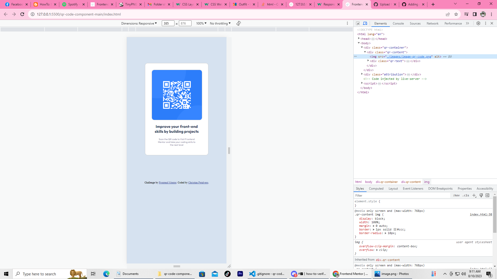
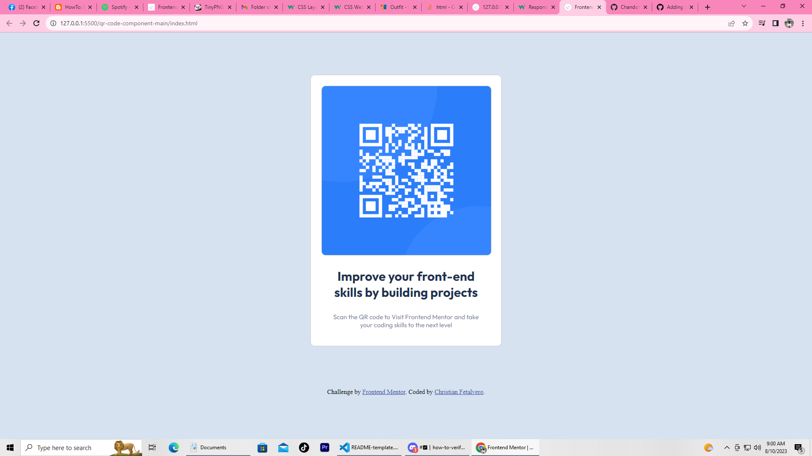

# Frontend Mentor - QR code component solution

This is a solution to the [QR code component challenge on Frontend Mentor](https://www.frontendmentor.io/challenges/qr-code-component-iux_sIO_H). Frontend Mentor challenges help you improve your coding skills by building realistic projects. 

## Table of contents

  - [Links](#links)
  - [Links](#screenshots)
  - [Built with](#built-with)
  - [Useful resources](#useful-resources)
  - [Author](#author)

### Links

- Live Site URL: [Add live site URL here](http://127.0.0.1:5500/qr-code-component-main/index.html)

### Screenshots

### Built with

- HTML
- CSS custom properties
- Media queries

If you want more help with writing markdown, we'd recommend checking out [The Markdown Guide](https://www.markdownguide.org/) to learn more.

### Useful resources

- [W3schools](https://www.w3schools.com/css/css_rwd_mediaqueries.asp) - This helped me for creating media queries and styles.

## Author

- Website - [Chan](https://github.com/Chandotcom)
- Frontend Mentor - [@Chandotcom](https://www.frontendmentor.io/profile/Chandotcom)

